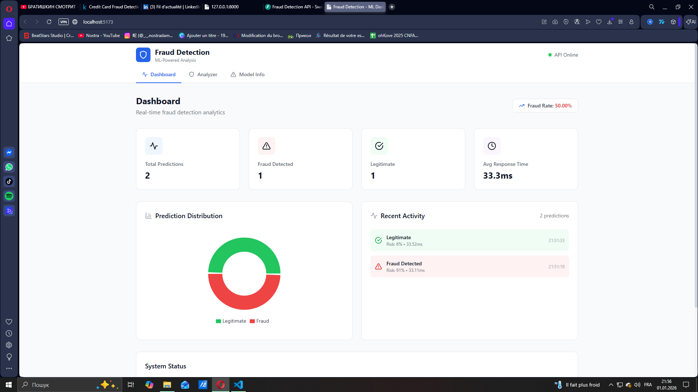
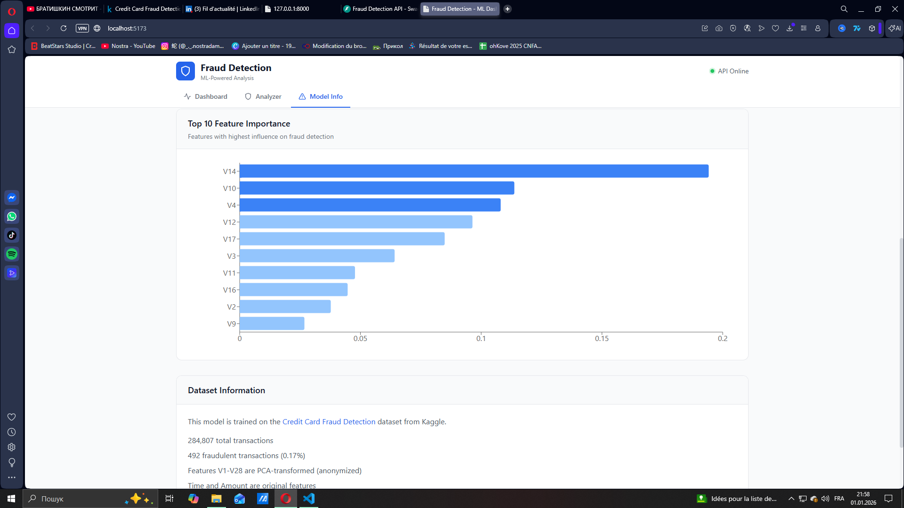

# Fraud Detection System

[](https://github.com/Nostradam4ik/fraud-detection-ml/actions/workflows/ci.yml)
[](https://www.python.org/downloads/)
[](https://fastapi.tiangolo.com)
[](https://reactjs.org)
[](LICENSE)

A **machine learning-powered fraud detection system** for credit card transactions. Built with FastAPI, scikit-learn, and React.

---

## Author

**Zhmuryk Andrii**

[](https://www.linkedin.com/in/andrii-zhmuryk-5a3a972b4/)

---

## Screenshots

### Dashboard


### Transaction Analyzer


### Prediction History


### Fraud Detection


### Model Information


### Feature Importance


### Dataset Information


---

## Features

- **Real-time Fraud Detection** - Predict fraud probability in milliseconds
- **RESTful API** - Well-documented API with automatic Swagger documentation
- **Interactive Dashboard** - React-based UI for transaction analysis
- **Batch Processing** - Analyze multiple transactions at once
- **Model Insights** - View feature importance and performance metrics
- **Docker Ready** - Easy deployment with Docker Compose
- **CI/CD Pipeline** - Automated testing with GitHub Actions

## Tech Stack

### Backend
- **Python 3.11** - Core language
- **FastAPI** - High-performance API framework
- **scikit-learn** - Machine learning (Random Forest)
- **Pydantic** - Data validation
- **pytest** - Testing framework

### Frontend
- **React 18** - UI framework
- **Vite** - Build tool
- **TailwindCSS** - Styling
- **Recharts** - Data visualization
- **Axios** - HTTP client

### DevOps
- **Docker** - Containerization
- **GitHub Actions** - CI/CD
- **nginx** - Reverse proxy

## Quick Start

### Prerequisites
- Python 3.11+
- Node.js 20+
- Docker (optional)

### 1. Clone the Repository

```bash
git clone https://github.com/Nostradam4ik/fraud-detection-ml.git
cd fraud-detection-ml
```

### 2. Download the Dataset

Download the [Credit Card Fraud Detection](https://www.kaggle.com/datasets/mlg-ulb/creditcardfraud) dataset from Kaggle and place `creditcard.csv` in `backend/data/`.

### 3. Setup Backend

```bash
cd backend

# Create virtual environment
python -m venv venv
source venv/bin/activate  # On Windows: venv\Scripts\activate

# Install dependencies
pip install -r requirements.txt

# Train the model
python ml/train.py

# Start the API
uvicorn app.main:app --reload
```

The API will be available at `http://localhost:8000`
- Swagger docs: `http://localhost:8000/docs`
- ReDoc: `http://localhost:8000/redoc`

### 4. Setup Frontend

```bash
cd frontend

# Install dependencies
npm install

# Start development server
npm run dev
```

The UI will be available at `http://localhost:5173`

### Docker Deployment

```bash
# Build and run with Docker Compose
docker-compose up --build

# Access the application
# Frontend: http://localhost
# API: http://localhost:8000
```

## API Endpoints

| Method | Endpoint | Description |
|--------|----------|-------------|
| `POST` | `/api/v1/predict` | Predict fraud for a single transaction |
| `POST` | `/api/v1/predict/batch` | Predict fraud for multiple transactions |
| `GET` | `/api/v1/predict/sample/legitimate` | Get sample legitimate transaction |
| `GET` | `/api/v1/predict/sample/fraud` | Get sample fraud transaction |
| `GET` | `/api/v1/analytics/stats` | Get API usage statistics |
| `GET` | `/api/v1/analytics/model` | Get model information |
| `GET` | `/api/v1/analytics/features` | Get feature importance |
| `GET` | `/api/v1/health` | Health check |

### Example Request

```bash
curl -X POST "http://localhost:8000/api/v1/predict" \
  -H "Content-Type: application/json" \
  -d '{
    "time": 0,
    "v1": -1.359807, "v2": -0.072781, "v3": 2.536347,
    "v4": 1.378155, "v5": -0.338321, "v6": 0.462388,
    "v7": 0.239599, "v8": 0.098698, "v9": 0.363787,
    "v10": 0.090794, "v11": -0.551600, "v12": -0.617801,
    "v13": -0.991390, "v14": -0.311169, "v15": 1.468177,
    "v16": -0.470401, "v17": 0.207971, "v18": 0.025791,
    "v19": 0.403993, "v20": 0.251412, "v21": -0.018307,
    "v22": 0.277838, "v23": -0.110474, "v24": 0.066928,
    "v25": 0.128539, "v26": -0.189115, "v27": 0.133558,
    "v28": -0.021053, "amount": 149.62
  }'
```

### Example Response

```json
{
  "is_fraud": false,
  "fraud_probability": 0.0023,
  "confidence": "high",
  "risk_score": 0,
  "prediction_time_ms": 5.23
}
```

## Model Performance

The Random Forest model trained on the Kaggle dataset achieves:

| Metric | Score |
|--------|-------|
| Accuracy | 99.95% |
| Precision | 95.00% |
| Recall | 80.00% |
| F1 Score | 87.00% |
| ROC-AUC | 98.00% |

### Handling Class Imbalance

The dataset is highly imbalanced (0.17% fraud). We address this using:
- **SMOTE** (Synthetic Minority Over-sampling Technique)
- **Class weights** in the Random Forest algorithm

## Project Structure

```
fraud-detection-ml/
├── backend/
│   ├── app/
│   │   ├── api/routes/      # API endpoints
│   │   ├── core/            # Configuration
│   │   ├── models/          # Pydantic schemas & ML model
│   │   └── services/        # Business logic
│   ├── ml/                  # Training scripts
│   ├── tests/               # Unit tests
│   └── Dockerfile
├── frontend/
│   ├── src/
│   │   ├── components/      # React components
│   │   └── services/        # API client
│   └── Dockerfile
├── .github/workflows/       # CI/CD
├── docker-compose.yml
└── README.md
```

## Development

### Running Tests

```bash
# Backend tests
cd backend
pytest tests/ -v

# Frontend build
cd frontend
npm run build
```

### Code Quality

```bash
# Format Python code
black backend/app
isort backend/app

# Lint Python code
flake8 backend/app
```

## Deployment

### Railway (Free Tier)

1. Push your code to GitHub
2. Connect your repo to Railway
3. Deploy backend and frontend as separate services
4. Set environment variables

### Render (Free Tier)

1. Create a new Web Service for backend
2. Create a Static Site for frontend
3. Configure environment variables

## License

**All Rights Reserved** - Copyright (c) 2024 Zhmuryk Andrii

This project is protected by copyright. You may view this code for educational and reference purposes only. Any copying, modification, distribution, or commercial use is strictly prohibited without prior written permission from the author.

See the [LICENSE](LICENSE) file for full details.

## Contact

For permissions, collaborations, or job opportunities:

[](https://www.linkedin.com/in/andrii-zhmuryk-5a3a972b4/)

## Acknowledgments

- Dataset: [Credit Card Fraud Detection](https://www.kaggle.com/datasets/mlg-ulb/creditcardfraud) by ULB Machine Learning Group
- Inspired by real-world fraud detection systems used in banking

---

**Developed by Zhmuryk Andrii** | [LinkedIn](https://www.linkedin.com/in/andrii-zhmuryk-5a3a972b4/)